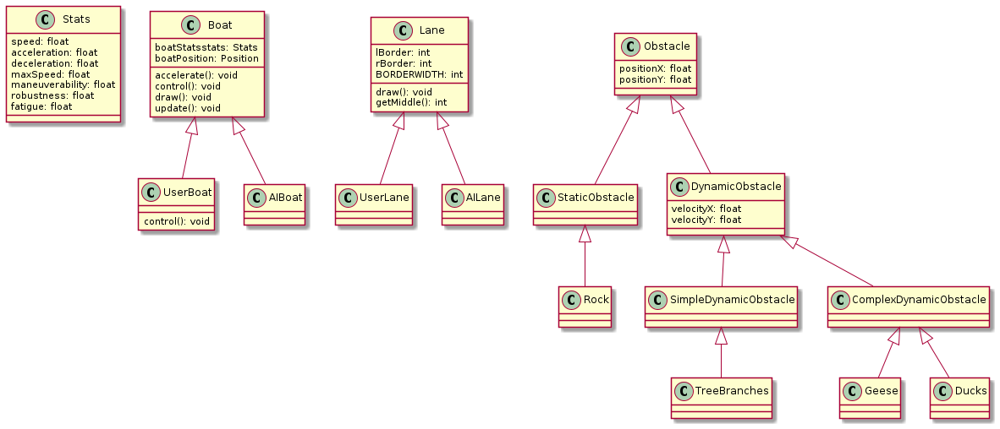

# umlClassDiagram
* Class diagram for the project, made in plantUML
* See [plantuml docs](https://plantuml.com/class-diagram) for syntax
---------------
## Rendered diagrams

!ECS Diagram.png](ECS Diagram.png)
